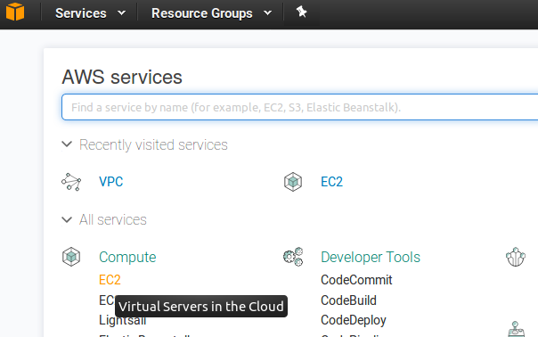

# Jupyter Notebook et Rstudio Server sur AWS

## liens utiles

Sources combinées pour faire cette documentation :

- [H20 et rstudio server](http://amunategui.github.io/h2o-on-aws/)
- [Jupyter Notebook](http://chrisalbon.com/jupyter/run_project_jupyter_on_amazon_ec2.html)
- [rstudio server](https://www.rstudio.com/products/rstudio/download-server/)
- [ssh tunneling putty](https://www.digitalocean.com/community/tutorials/how-to-set-up-jupyter-notebook-for-python-3)
- [source anaconda](https://www.continuum.io/downloads#linux)
- [gestion utilisateurs sur ec2](http://docs.aws.amazon.com/AWSEC2/latest/UserGuide/managing-users.html)

## Créer un compte sur AWS

[Amazon Web Services](https://aws.amazon.com/fr/)

Suivre les instructions et s'entraîner dans un premier temps sur les instances gratuites.

## Créer un VPC (Virtual Private Cloud)


## Création de la VM




## Paramétrage de la VM


## Authentification


## Putty pour la connexion ssh

[doc aws sur putty](http://docs.aws.amazon.com/fr_fr/AWSEC2/latest/UserGuide/putty.html)

## Connexion à l'instance ec2

Si notre machine locale est sous linux :

```bash
# le dossier où on a mis la keypair.pem
cd ~/Dropbox/keypair/ # endroit où on a déposé sa clé
chmod 400 datascience.pem
ssh -i "datascience.pem" ubuntu@ec2-XXXXXXX.eu-central-1.compute.amazonaws.com
```
Si notre machine locale est sous windows : utiliser Putty


## Installation sur la VM de Rstudio server et H2O

On est maintenant logué dans la machine virtuelle : les commandes suivantes sont exécutées par l'instance ec2.

```bash
# installation de R et rstudio server
sudo apt-get install r-base
sudo apt-get install gdebi-core
wget https://download2.rstudio.org/rstudio-server-1.0.136-amd64.deb
sudo gdebi rstudio-server-1.0.136-amd64.deb

# h2o nécessite java et curl
sudo apt-get install libcurl4-openssl-dev
sudo apt-get install default-jre

# add user : adapter à son usage
sudo useradd david
echo "david:monpassword" | sudo chpasswd
sudo mkhomedir_helper david
```
## installation H2O

Aller sur l'url de l'instance ec2 (à récupérer dans la console AWS) qui a cette forme : http://ec2-XXXXX.eu-central-1.compute.amazonaws.com:8787

S'identifier avec son user (dans l'exemple : david) et son mot de passe (dans l'exemple : monpassword) puis lancer les commandes suivantes dans R studio server :

```R
install.packages("h2o")
library(h2o)
localH2O = h2o.init()
demo(h2o.glm)
demo(h2o.gbm)
```


## installation python

Après s'être connecté à l'instance ec2 via ssh (cf section précédente) :

```bash
cd ~
wget https://repo.continuum.io/archive/Anaconda3-4.3.0-Linux-x86_64.sh
bash Anaconda3-4.3.0-Linux-x86_64.sh
source ~/.bashrc

mkdir ~/Notebooks
tmux # on veut lancer le serveur dans un onglet tmux
cd ~/Notebooks
jupyter notebook
# bien récuperer l'url indiquée lors du lancement de la commande.
# si on oublie, on peut lancer la commande : jupyter notebook list
# l'url a la forme : http://localhost:8888/?token=6cf7df71be234f35e86XXXXc326e150390fadfcdcbe5e94a
```

controle-b d permet de quitter tmux et le serveur (lancé par la commande jupyter notebook) continuera de tourner.

## SSH tunneling

Permet d'associer une url à joindre depuis le pc local qui permet d'atteindre l'instance ec2 via ssh.
La session

Si on a un pc local sous linux, on utilise cette commande :

```bash
# sous la machine locale, commande linux
cd ~/Dropbox/keypair/ # endroit où on a déposé sa clé
ssh -i "datascience.pem" -L 8888:localhost:8888 ubuntu@ec2-XXXXXXX.eu-central-1.compute.amazonaws.com
```
Si on a un pc local sous windows, il faut utiliser putty

Enfin, aller à l'url http://localhost:8888/?token=6cf7df71be234f35e86XXXXc326e150390fadfcdcbe5e94a depuis son navigateur.

## Jupyter Notebook avec mot de passe
